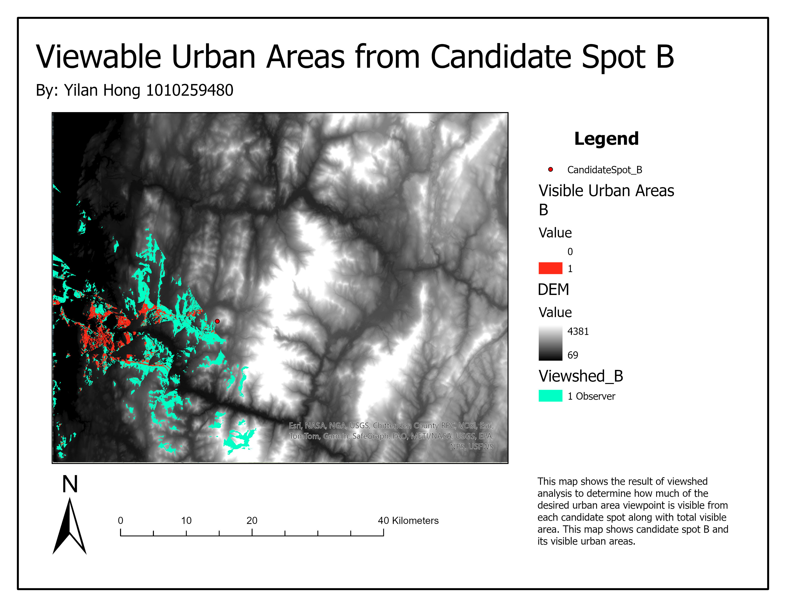
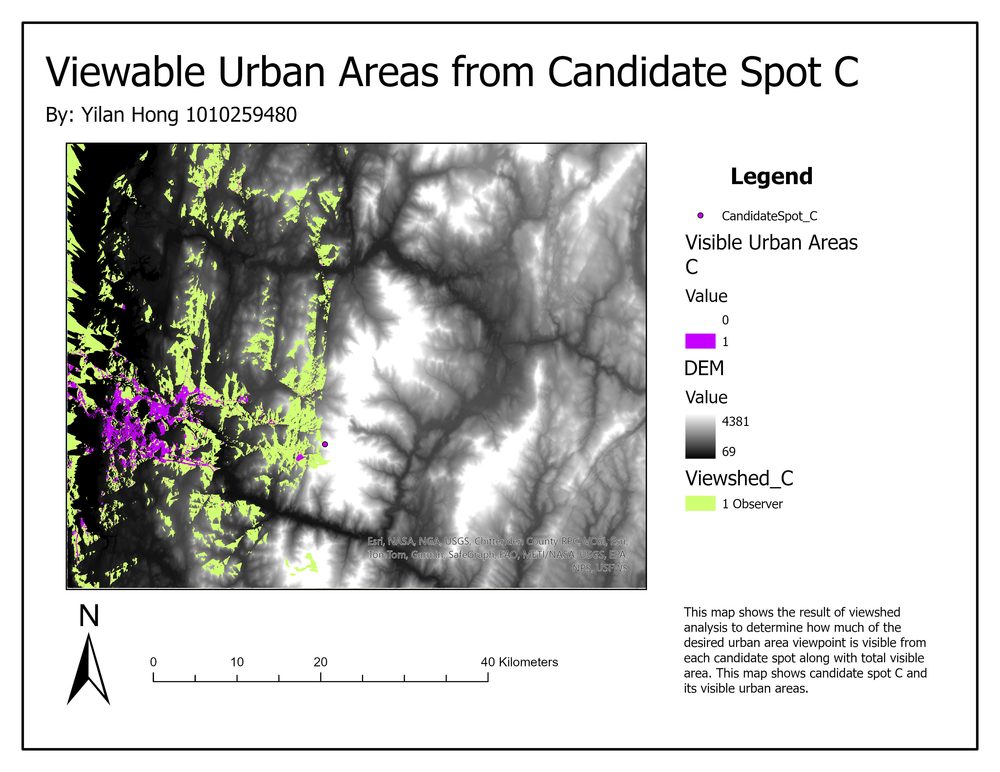
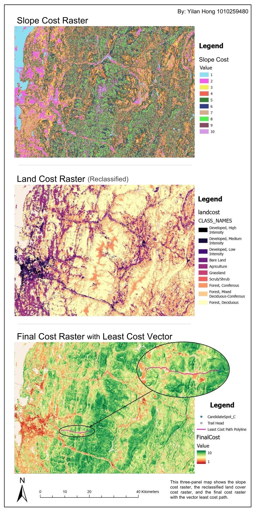
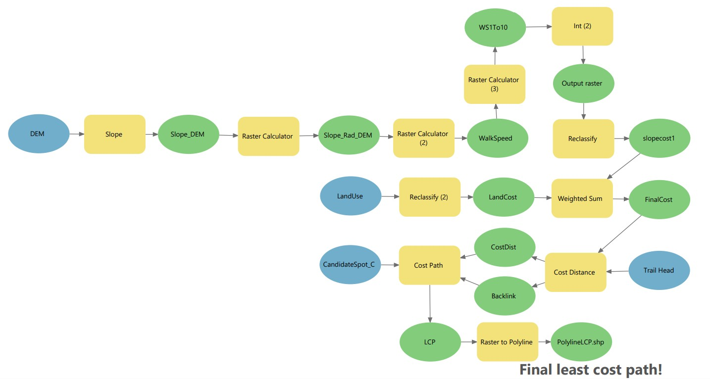

The goal of this project was to determine the best viewing location out of 3 candidate spots, then using the trail head starting point, determine the least cost path trail that would connect the trail head to the viewing spot. This project was more complex, and was comprised of 3 main steps. First, completing a viewshed analysis on each potential candidate spot to see which spot can see the most of the desired urban area. Next, once the ideal spot is identified, I created a slope cost and a reclassified land cost raster. Finally, these two rasters were combined with the weighted sum tool to create the final cost raster, and from there the least cost path was created using the previously made cost rasters to create the optimal trail path that crosses over the most ideal terrain and slope while considering distance. The process for creating these rasters and the final polyline path was done through the model builder tool and can be seen below.

